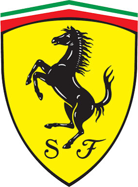

# 🏎️ FERRARI DIGITAL GARAGE

<p align="center">
  
</p>

<p align="center">
  <strong>An ultra-premium, interactive 3D automotive showroom and digital archive celebrating the engineering mastery and racing pedigree of Maranello.</strong>
</p>

<p align="center">
  <a href="https://github.com/RahulBongu/ferrari/actions/workflows/deploy.yml"></a>
  
  
  
  
  
</p>

---

## 🌟 Overview

The **Ferrari Digital Garage** is an immersive digital web platform designed to recreate the visceral thrill, aerodynamic elegance, and acoustic glory of Ferrari's greatest machines. From the raw homologation fury of the **288 GTO** and **F40** to hybrid hypercar benchmarks like **LaFerrari** and modern icons like the **Daytona SP3** and **12Cilindri**, users explore high-fidelity 3D models, technical telemetry, and interactive mechanical dissections.

Live Site: **[https://rahulbongu.github.io/ferrari/](https://rahulbongu.github.io/ferrari/)**  
Repository: **[https://github.com/RahulBongu/ferrari](https://github.com/RahulBongu/ferrari)**

---

## ✨ Key Features

### 🎬 1. Cinematic Hero Welcome
- **4K Autoplay Video**: High-definition track footage of Ferrari hypercars at speed.
- **Instant Hero Backdrop**: Preloaded high-resolution hero imagery ensures zero blank or black flash while media streams.
- **Intelligent Audio Engine**: Smooth sinusoidal volume fade-in upon user interaction or the "SOUND ON" toggle, strictly following modern browser autoplay security policies across Chrome, Safari, Edge, and Firefox.
- **Cinematic Transition**: Dynamic zoom and audio burst transitioning seamlessly into the digital showroom.

### 💥 2. 240-Frame 4K Exploded Scrollytelling View
- **Interactive Mechanical Breakdown**: Scrub through an ultra-crisp 240-frame sequence disassembling the **Ferrari LaFerrari** down to its carbon-fiber tub, V12 powertrain, dihedral doors, and active aerodynamics.
- **Top Inline Scroll Guide**: Refined, pulsating `SCROLL DOWN` guide capsule situated directly beside the Ferrari LaFerrari title for intuitive user orientation.
- **Dynamic Scroll Acoustics**: Real-time synthesized scrolling audio that adapts to scroll direction, paired with an authentic high-RPM V12 throttle blast at the transition point.
- **Adaptive Canvas Renderer**: Zero black-flash fallback and responsive aspect scaling across ultra-wide monitors, laptops, and mobile viewports.

### 🌐 3. Interactive 3D Studio (WebGL / Three.js)
- **360° Free Orbit & Zoom**: Inspect photorealistic `.glb` 3D models of legendary Ferraris with orbit controls, auto-spin idle rotation, and damping physics.
- **Studio Lighting & Reflections**: Ambient environment maps with soft studio floor contact shadows and metallic flake automotive paint shaders.
- **Multi-Angle Camera Presets**: One-click camera pivots between 3D Perspective, Top Profile, Side Profile, and Rear Angle.
- **Live 3D Scuderia Shield**: Interactive rotating 3D Ferrari Cavallino Rampante logo in the collection showroom.

### 📊 4. Telemetry Specs & Direct Comparison Suite
- **Side-by-Side Analysis**: Compare any two models across engine displacement, horsepower (CV), torque, 0-100 km/h sprint times, top speed, dry weight, and aerodynamic downforce.
- **Quick Selection Matrix**: Effortlessly swap, remove, and benchmark cars against each other with instant badge feedback.

### 🔊 5. Web Audio API Acoustic Engine
- **Synthesized Engine Acoustics**: Procedurally generates harmonic engine frequencies, cylinder pulses, and throttle revs via the Web Audio API.
- **Directional Sound Design**: Exploded scrub acoustics respond dynamically to scroll momentum and direction.

### 🌓 6. Dual Scuderia Aesthetics (Dark & Light Mode)
- **Rosso Corsa Accents**: Handcrafted color schemes tuned for high-contrast visibility and racing aesthetics in both dark carbon-fiber and clean studio light themes.
- **Ferrari Racing Typography**: High-impact condensed display titles, monospace technical telemetry readouts, and clean sans-serif body typography.

---

## 🏎️ Vehicle Lineup

| Vehicle | Era | Powertrain | Top Speed | 0-100 km/h | Power (CV) |
| :--- | :--- | :--- | :--- | :--- | :--- |
| **Ferrari 288 GTO** | 1984 | 2.8L Twin-Turbo V8 | 305 km/h | 4.8 s | 400 CV |
| **Ferrari F40** | 1987 | 2.9L Twin-Turbo V8 | 324 km/h | 4.1 s | 478 CV |
| **Ferrari 550 Barchetta** | 2000 | 5.5L Naturally Aspirated V12 | 320 km/h | 4.4 s | 485 CV |
| **Ferrari 599 GTO** | 2010 | 6.0L Naturally Aspirated V12 | 335 km/h | 3.3 s | 670 CV |
| **Ferrari 599XX Evolution** | 2011 | 6.0L Track-Only V12 | 345 km/h | 2.9 s | 750 CV |
| **Ferrari LaFerrari** | 2013 | 6.3L V12 + HY-KERS Electric | 350 km/h | 2.4 s | 963 CV |
| **Ferrari 488 Pista Spider** | 2019 | 3.9L Twin-Turbo V8 | 340 km/h | 2.85 s | 720 CV |
| **Ferrari Monza SP2** | 2019 | 6.5L Naturally Aspirated V12 | > 300 km/h | 2.9 s | 810 CV |
| **Ferrari F1 (SF90)** | 2019 | 1.6L Turbo Hybrid V6 | 360 km/h | 1.85 s | ~1000 CV |
| **Ferrari F8 Spider** | 2020 | 3.9L Twin-Turbo V8 | 340 km/h | 2.9 s | 720 CV |
| **Ferrari Daytona SP3** | 2022 | 6.5L Naturally Aspirated V12 | 340 km/h | 2.85 s | 840 CV |
| **Ferrari 296 GT3** | 2023 | 3.0L 120° Twin-Turbo V6 | 290 km/h | 3.0 s | 600 CV |
| **Ferrari Purosangue** | 2023 | 6.5L Naturally Aspirated V12 | 310 km/h | 3.3 s | 725 CV |
| **Ferrari SF90 Spider Mansory** | 2023 | 4.0L Twin-Turbo V8 + Tri-Motor | 355 km/h | 2.4 s | 1100 CV |
| **Ferrari 12Cilindri** | 2025 | 6.5L Naturally Aspirated V12 | > 340 km/h | 2.9 s | 830 CV |

---

## 🛠️ Tech Stack & Architecture

- **Core Framework**: [React 19](https://react.dev/) + [TypeScript](https://www.typescriptlang.org/)
- **Build Tool**: [Vite 8](https://vite.dev/) with Rollup bundler
- **Styling**: [Tailwind CSS v4](https://tailwindcss.com/) + [Styled Components](https://styled-components.com/)
- **3D Graphics**: [Three.js](https://threejs.org/) + [@react-three/fiber](https://docs.pmnd.rs/react-three-fiber) + [@react-three/drei](https://github.com/pmndrs/drei)
- **State Management**: [Zustand](https://github.com/pmndrs/zustand)
- **Routing**: [React Router v7](https://reactrouter.com/) (with SPA query-param redirection for GitHub Pages)
- **Audio Synthesis**: Native Web Audio API (`AudioContext`, `GainNode`, oscillator harmonics)
- **Icons**: [Lucide React](https://lucide.dev/)
- **Asset Storage**: [Git LFS](https://git-lfs.com/) (for 3D `.glb` meshes & `.webm` media files)

---

## 📦 Git LFS & Asset Architecture

Large binary files such as 3D models (`*.glb`) and high-resolution video streams (`*.webm`) are tracked using **Git LFS** to avoid GitHub's 100 MB per-file push limit and ensure lean repository clones.

```gitattributes
# .gitattributes
public/assets/videos/*.webm filter=lfs diff=lfs merge=lfs -text
public/assets/models/*.glb filter=lfs diff=lfs merge=lfs -text
```

The app includes an **asset resolution helper** (`src/utils/assetUrl.ts`) that guarantees assets load seamlessly on both:
1. **Local Development**: `http://localhost:5173/assets/...`
2. **GitHub Pages Deployment**: `https://rahulbongu.github.io/ferrari/assets/...`

---

## 🚀 Getting Started (Local Development)

### Prerequisites
- [Node.js](https://nodejs.org/) (v20 or higher recommended)
- [Git](https://git-scm.com/) with [Git LFS](https://git-lfs.com/) installed

### 1. Clone the Repository
```bash
git clone https://github.com/RahulBongu/ferrari.git
cd ferrari
```

### 2. Pull Git LFS Objects
```bash
git lfs install
git lfs pull
```

### 3. Install Dependencies
```bash
npm install
```

### 4. Run Development Server
```bash
npm run dev
```
Navigate to `http://localhost:5173` in your browser.

### 5. Build for Production
```bash
npm run build
```

---

## 🌐 GitHub Pages Deployment Guide

This project includes an automated **dual-channel deployment pipeline** located at [`.github/workflows/deploy.yml`](.github/workflows/deploy.yml):
1. **GitHub Actions Pages Artifact**: Deploys directly via the new GitHub Pages pipeline.
2. **`gh-pages` Branch Fallback**: Automatically updates the `gh-pages` branch for zero-config deployments.

### Enabling Deployment on Your GitHub Repository:
1. Open your repository on GitHub: **`https://github.com/RahulBongu/ferrari`**
2. Click on **Settings** (top right tab).
3. In the left sidebar, click **Pages** (under *Code and automation*).
4. Under **Build and deployment > Source**, select **GitHub Actions** (or **Deploy from a branch** → select `gh-pages`).
5. Any push to `main` will build and publish the live site at:  
   👉 **`https://rahulbongu.github.io/ferrari/`**

---

## 📁 Project Structure

```
ferrari/
├── .github/
│   └── workflows/
│       └── deploy.yml           # GitHub Pages automated CI/CD
├── public/
│   ├── 404.html                 # SPA redirect fallback for GitHub Pages
│   ├── favicon.svg              # Tab icon
│   └── assets/
│       ├── audio/               # Explode scroll & landing audio
│       ├── exploded/            # 240 sequential 4K JPG frames (LaFerrari)
│       ├── models/              # 17 interactive 3D GLB models (Git LFS)
│       ├── photos/              # Vehicle photography & Ferrari crests
│       └── videos/              # 4K landing video (Git LFS)
├── src/
│   ├── components/
│   │   ├── common/              # Theme switch, loader, vehicle image
│   │   ├── garage/              # Exploded view & interactive canvas
│   │   ├── navigation/          # Navbar, sound toggle, mobile drawer
│   │   └── vehicle/             # 3D canvas, specs drawer, comparisons
│   ├── data/
│   │   └── vehicles.ts          # Comprehensive vehicle specs & metadata
│   ├── pages/
│   │   ├── LandingPage.tsx      # Cinematic landing video experience
│   │   ├── GaragePage.tsx       # Showroom & scrollytelling exploded view
│   │   ├── CarsPage.tsx         # Full collection grid & 3D logo studio
│   │   ├── ComparePage.tsx      # Multi-vehicle telemetry comparison
│   │   └── VehiclePage.tsx      # Deep dive 360° inspector & specifications
│   ├── store/                   # Zustand stores (comparison, test drive)
│   ├── three/                   # Three.js scene, lighting, controls
│   ├── utils/
│   │   ├── assetUrl.ts          # Base URL resolver for GitHub Pages
│   │   └── engineAudio.ts       # Web Audio API engine sound synthesizer
│   ├── App.tsx                  # BrowserRouter routing with base path
│   └── main.tsx                 # React DOM mount point
├── .gitattributes               # Git LFS tracking rules
├── .gitignore                   # Ignored files (dist, node_modules)
├── index.html                   # HTML entry with SPA query decoder
├── package.json                 # Project dependencies & scripts
├── tsconfig.json                # TypeScript compiler config
└── vite.config.ts               # Vite bundler configuration
```

---

## 👤 Author & Acknowledgments

- **Creator**: **Rahul Bongu** ([@RahulBongu](https://github.com/RahulBongu))
- **Repository**: [RahulBongu/ferrari](https://github.com/RahulBongu/ferrari)
- **Ferrari Branding**: Ferrari®, the Prancing Horse emblem, and all related vehicle designs and trademarks are property of *Ferrari S.p.A.* This project is created for educational, design, and non-commercial portfolio purposes.

---

<p align="center">
  <sub>Designed with ❤️ and built for speed. Forza Ferrari.</sub>
</p>
